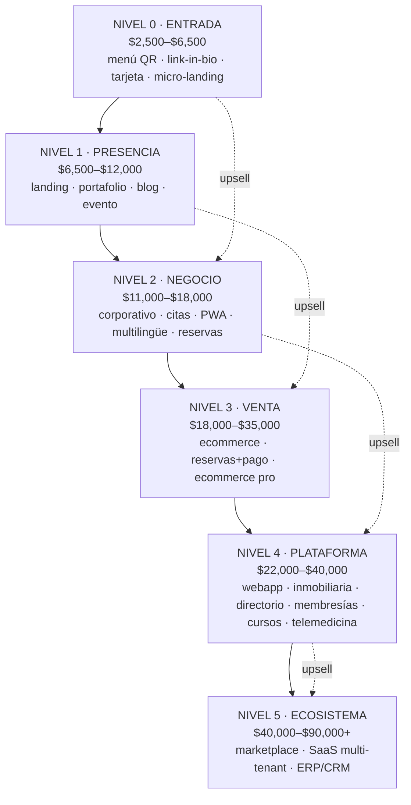
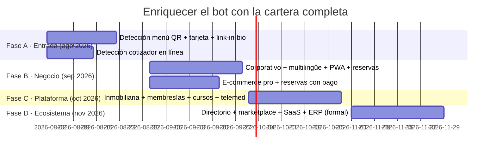

# 📊 Evaluación de Mercado · Catálogo Completo de Páginas Web · Agencia Vibecoder

> **Documento estratégico del CEO / Director General / AI Strategist** — v1.0
> Fecha: agosto 2026 · Mercado: **México** (SMB y empresas medianas).
>
> **Propósito:** evaluar TODOS los tipos de página que la agencia vibecoder puede
> fabricar — **desde el menú digital más simple hasta el marketplace / ERP más
> complejo** — con su **presupuesto de mercado**, y definir **cómo enriquecer al bot
> "Alex" y todo su flujo de cotización** con esa cartera.
>
> **Para quién está escrito:** este `.md` es **legible por Roo Code + DeepSeek en
> VSCode**. Léelo como insumo para: (a) ampliar `lib/pricing-catalog.ts`,
> `lib/agency-catalog.ts`, `lib/industry-pricing.ts`, `lib/conversation-flow.ts`,
> `lib/bots-catalog.ts` y `lib/prompt-builder.ts`; y (b) calibrar el copy, los precios
> y los upsells del bot. No es un artículo: es una **especificación de cartera**.

---

## 0. Cómo usar este documento (instrucciones para el agente IA)

1. **Fuente de verdad de precios** = las tablas de §3 y §5. NUNCA hardcodear montos en
   componentes/copys: cuando se implemente un tipo nuevo, registrar su `precioDesde` en
   `lib/agency-catalog.ts` y su base por nivel en `lib/pricing-catalog.ts`, y dejar que
   `calcularTotalDeterminista()` (en `lib/quote-engine.ts`) produzca el total exacto
   (regla #7 de `AGENTS.md`: UI, PDF, copy y fallback citan el MISMO número).
2. **Cada tipo del §5 incluye**: para quién · rango de mercado MXN · precio "desde" ·
   tiempo · complejidad · características modulares (features) · bots cross-sell ·
   **keywords de detección** (para `inferCategory`/`extractSignals`) · upsell natural.
3. **La escalera de §2 es la columna vertebral del flujo**: el bot debe _subir_ al
   cliente por la escalera (entrada barata → upsell → recurrente), no saltar al tope.
4. **Antes de editar código**: lee `AGENTS.md` (§0 estado de la rama, §11 tareas →
   dónde tocar) y este doc. Tras editar precios corre `npm run test:regression`,
   `npm run test:eval` y `npm run prompt:preview`.
5. **Prioridad de implementación** para enriquecer el bot: los tipos con mayor
   frecuencia de mercado y menor esfuerzo primero (marcados con ⭐ en §6.2).

---

## 1. Resumen ejecutivo (tesis del CEO)

**Tesis:** _"Cobertura total del mercado con una escalera de precio-atracción:
entrar por el menú QR / landing más baratos, vender el sistema que el negocio
realmente necesita, y cobrar recurrente con IA."_

**El problema de la cartera actual:** el bot hoy cotiza **6 categorías** (landing,
ecommerce, citas, webapp, blog, portafolio) y la agencia tiene **18 tipos** en
`agency-catalog.ts`, pero el mercado mexicano SMB compra muchos productos que aún no
se cotizan bien (menú digital, tarjeta digital, link-in-bio, cotizador en línea,
reservas con pago, inmobiliaria, membresías, cursos, telemedicina, marketplace). Cada
tipo no cotizado = **venta perdida o cotización inflada/deflactada**.

**La oportunidad:** el abanico "barato → premium" va de **$2,500 a $90,000+ MXN**.
La cuña de entrada (menú QR $3,500 · tarjeta $4,500 · link-in-bio $2,500 · landing
$8,500) captura al negocio que "solo quiere estar en internet"; la escalera lo lleva
al sistema que resuelve su operación; el MRR (bots + mantenimiento) lo retiene.

**Tres decisiones estratégicas de esta evaluación:**

1. **Ampliar la detección del bot** a los ~28 tipos de §3 (con sus keywords y su
   `precioDesde`), para que **nadie que cotice quede sin propuesta**.
2. **Mantener el anclaje "desde" barato** en cada tipo (cuartil bajo-medio del
   mercado) y subir el ticket con **features modulares** y **bots** (no con inflación
   del base).
3. **Priorizar la implementación por ticket × frecuencia** (ver §6.2 ⭐).

---

## 2. La escalera de complejidad (del menú al ecosistema)

**Lógica de venta de la escalera:** cada nivel es un _upsell natural_ del anterior.
El bot debe detectar el nivel del cliente por su descripción y ofrecer el nivel
siguiente como "lo que sigue cuando crezcas" (no abrumar con el tope).

| Nivel | Nombre     | Ticket "desde"   | Qué resuelve                                  | MRR asociado          |
| ----- | ---------- | ---------------- | --------------------------------------------- | --------------------- |
| 0     | Entrada    | $2,500–$6,500    | "No aparezco / pierdo clientes"               | FAQ/leads $199/mes    |
| 1     | Presencia  | $6,500–$12,000   | "Necesito que me encuentren y me contacten"   | FAQ/leads $199/mes    |
| 2     | Negocio    | $11,000–$18,000  | "Necesito ordenar mis citas/mi empresa"       | Bot citas $299/mes    |
| 3     | Venta      | $18,000–$35,000  | "Necesito vender/agendar con pago en línea"   | Bot ventas $449/mes   |
| 4     | Plataforma | $22,000–$40,000  | "Necesito un sistema que ordene mi operación" | Bot ventas $449/mes   |
| 5     | Ecosistema | $40,000–$90,000+ | "Necesito una plataforma que escale"          | Mantenimiento/soporte |

---

## 3. Catálogo maestro (28 tipos · mercado vs. precio "desde")

> Columna **"código"**: ✅ = ya cotiza el motor / catálogo · 🔶 = en `agency-catalog.ts`
> pero NO lo detecta el motor (`inferCategory`) · 🆕 = propuesto (nuevo).
> **Rango de mercado** = lo que cobra la competencia en México (freelancer → agencia boutique).
>
> 📌 **Estado de implementación (FASES 1-8 de `docs/IMPLEMENTACION_CARTERA_ROO.md`):** la
> cartera de 28 tipos ya está implementada en el código — los 4 de entrada
> (menú/tarjeta/link-in-bio/cotizador) y corporativo son categorías propias del motor
> (11 categorías); las verticales N4 (inmobiliaria/membresías/cursos/telemedicina/directorio)
> y el ecosistema N5 (marketplace/SaaS/ERP) se detectan como **webapp por señales pasivas +
> features** (no categorías nuevas) y se cotizan con "desde" + propuesta formal (N5).
> Los marcadores 🆕/🔶 de la columna "código" indican el estado de planificación
> (previo a la implementación), no el estado actual del repo.

| #   | Tipo                             | Nv  | Código | Rango de mercado MXN | Desde  | Entrega     | Complejidad |
| --- | -------------------------------- | --- | ------ | -------------------- | ------ | ----------- | ----------- |
| 1   | Link-in-bio premium              | 0   | 🆕     | $1,000–$4,000        | 2,500  | 1-2 días    | Básica      |
| 2   | Menú digital con QR              | 0   | 🔶     | $1,500–$6,000        | 3,500  | 2-4 días    | Básica      |
| 3   | Tarjeta digital / minisitio      | 0   | 🆕     | $3,000–$8,000        | 4,500  | 2-4 días    | Básica      |
| 4   | Micro-landing promocional        | 0   | 🆕     | $3,000–$7,000        | 4,500  | 2-4 días    | Básica      |
| 5   | Perfil Google Business (setup)   | 0   | 🆕     | $1,500–$5,000        | 3,000  | 2-3 días    | Básica      |
| 6   | Landing de evento                | 1   | 🔶     | $5,000–$12,000       | 6,500  | 3-7 días    | Básica      |
| 7   | Portafolio profesional           | 1   | ✅     | $5,000–$15,000       | 7,000  | 4-10 días   | Media       |
| 8   | Landing page                     | 1   | ✅     | $5,000–$12,000       | 8,500  | 3-8 días    | Básica      |
| 9   | Blog / contenido                 | 1   | ✅     | $6,000–$18,000       | 9,000  | 5-12 días   | Media       |
| 10  | Sitio multilingüe                | 2   | 🔶     | $10,000–$25,000      | 11,000 | 6-12 días   | Media       |
| 11  | PWA instalable                   | 2   | 🔶     | $12,000–$35,000      | 12,000 | 7-15 días   | Media       |
| 12  | Reservas de restaurante          | 2   | 🔶     | $12,000–$30,000      | 12,000 | 7-12 días   | Media       |
| 13  | Cotizador / presupuesto en línea | 2   | 🆕     | $12,000–$30,000      | 15,000 | 8-15 días   | Media       |
| 14  | Sistema de citas                 | 2   | ✅     | $12,000–$35,000      | 15,000 | 7-18 días   | Media       |
| 15  | Sitio corporativo (multi-página) | 2   | 🔶     | $10,000–$25,000      | 15,000 | 7-15 días   | Media       |
| 16  | Reservas con pago por adelantado | 3   | 🔶     | $18,000–$40,000      | 18,000 | 10-20 días  | Avanzada    |
| 17  | E-commerce                       | 3   | ✅     | $18,000–$60,000      | 20,000 | 10-25 días  | Avanzada    |
| 18  | E-commerce pro (cuentas+panel)   | 3   | 🔶     | $30,000–$70,000      | 28,000 | 15-30 días  | Avanzada    |
| 19  | Directorio / listado             | 4   | 🔶     | $25,000–$80,000      | 22,000 | 15-25 días  | Avanzada    |
| 20  | Plataforma / webapp a medida     | 4   | ✅     | $25,000–$120,000     | 25,000 | 10-30 días  | Avanzada    |
| 21  | Portal inmobiliario              | 4   | 🔶     | $30,000–$90,000      | 25,000 | 15-30 días  | Avanzada    |
| 22  | Portal de citas para salud       | 4   | 🔶     | $40,000–$120,000     | 26,000 | 15-30 días  | Avanzada    |
| 23  | Portal de membresías             | 4   | 🔶     | $35,000–$90,000      | 28,000 | 15-30 días  | Avanzada    |
| 24  | Plataforma de cursos online      | 4   | 🔶     | $35,000–$100,000     | 30,000 | 20-35 días  | Avanzada    |
| 25  | Marketplace multi-vendedor       | 5   | 🔶     | $60,000–$250,000     | 40,000 | 30-60 días  | Avanzada    |
| 26  | Marketplace con split de pagos   | 5   | 🆕     | $100,000–$300,000    | 70,000 | 45-90 días  | Avanzada    |
| 27  | SaaS multi-tenant B2B            | 5   | 🆕     | $100,000–$500,000    | 60,000 | 45-90 días  | Avanzada    |
| 28  | ERP / CRM a medida               | 5   | 🆕     | $150,000–$800,000    | 90,000 | 60-120 días | Avanzada    |

**Lectura de mercado:** estamos en el **cuartil bajo-medio con acabado premium**. En
los tipos de entrada (menú/tarjeta/link-in-bio) la competencia es freelancers y
plataformas "página gratis" (Wix, Carrd, Canva) — nuestra ventaja es **hecho a la
medida + SEO + bot de WhatsApp + soporte**. En los tipos de plataforma (webapp,
marketplace, ERP) la competencia son agencias boutique que cobran 2-4× más; nuestro
margen está en la **estandarización con packs Roo Code** (`prompt-builder`).

---

## 4. Presupuestos y psicología de precio (reglas no negociables)

### 4.1 Principios (heredados de `docs/MERCADO_VIBECODER.md` §6)

1. **Un solo número exacto** en lo que ve el cliente (`calcularTotalDeterminista()`).
2. **Anclaje "desde"**: cada tipo muestra su base barata; las features suben el total.
3. **Señuelo profesional**: en `PRICING_CATALOG` cada categoría tiene 3 niveles
   (básico/profesional/avanzado); el profesional es el que más se debe cerrar.
4. **Reencuadre mensual**: `cuota_mensual = total / 24` → un proyecto de $25,000 se
   siente como ~$1,042/mes.
5. **Bundling de bots**: el setup del bot suma al total exacto; la mensualidad se
   muestra aparte ("desde $199/mes") — es el corazón del margen recurrente.

### 4.2 Presupuesto típico por segmento (para calibrar el clamp de `industry-pricing.ts`)

| Segmento (GIRO)        | Tier     | Presupuesto típico | Producto de entrada             | Upsell natural                      |
| ---------------------- | -------- | ------------------ | ------------------------------- | ----------------------------------- |
| Restaurante/cafetería  | Medio    | $10k–$32k          | Menú QR $3,500                  | Reservas $12k · bot FAQ $199/mes    |
| Estética/barbería/spa  | Medio    | $10k–$32k          | Landing $8,500                  | Citas $15k · bot citas $299/mes     |
| Consultorio/clínica    | Alto     | $15k–$70k          | Citas $15k                      | Telemedicina $26k · bot citas       |
| Abogado/despacho       | Alto     | $15k–$70k          | Corporativo $15k                | Bot ventas $449/mes + SEO           |
| Inmobiliaria           | Alto     | $15k–$70k          | Portal $25k                     | Bot ventas + leads por propiedad    |
| Gimnasio/academia      | Medio    | $10k–$32k          | Landing $8,500                  | Membresías $28k · bot membresías    |
| Coach/instructor       | Medio    | $10k–$32k          | Landing $8,500                  | Cursos online $30k · membresías     |
| Tienda/retail          | Ajustado | $5k–$20k           | Landing $8,500                  | Ecommerce $20k · bot dudas $299/mes |
| Mecánico/servicios     | Ajustado | $5k–$20k           | Landing $8,500 / tarjeta $4,500 | Bot FAQ $199/mes · cotizador $15k   |
| Constructor/desarrollo | Alto     | $15k–$70k          | Corporativo + galería $15k      | Bot cotización + portal $25k        |

### 4.3 Regla de oro para el bot

> **Nunca ofrezcas el tope de la escalera a quien describe un problema de entrada.**
> Si el cliente dice "que me encuentren en Google", cotiza landing/menú, NO ecommerce.
> El ecommerce solo se activa con señales reales de venta en línea (carrito, pagos,
> envíos, "vender por internet") — ya implementado en `inferCategory`.

---

## 5. Detalle por tipo (para implementación en el bot)

> Para cada tipo: **keywords** = input para `inferCategory`/`extractSignals`
> (palabra completa, con límites, consciente de negación — reglas 5-6 de AGENTS.md).
> **Features** = módulos que suman precio. **Bots** = cross-sell de `bots-catalog.ts`.

### NIVEL 0 · Productos de entrada (captura de clientes)

#### 1 · Link-in-bio premium 🆕

- **Para quién:** creadores de contenido, pequeños negocios con solo Instagram/TikTok.
- **Mercado:** $1,000–$4,000. **Desde:** $2,500. **Entrega:** 1-2 días.
- **Features:** +QR físico ($500) · +mini-catálogo de fotos ($1,000) · +bot FAQ ($3,500 setup).
- **Bots:** bot_faq ($3,500 + $199/mes).
- **Keywords:** "link en mi bio", "link de instagram", "links de mis redes", "una página con mis enlaces", "mi perfil".
- **Upsell:** tarjeta digital → landing.

#### 2 · Menú digital con QR 🔶 (ya en `agency-catalog.ts`, falta detección)

- **Para quién:** restaurantes, cafeterías, bares, food trucks.
- **Mercado:** $1,500–$6,000. **Desde:** $3,500. **Entrega:** 2-4 días.
- **Features:** +sección de promociones ($800) · +pedido por WhatsApp directo desde el menú ($1,000) · +multi-idioma ($1,500).
- **Bots:** bot_faq ($3,500 + $199/mes).
- **Keywords:** "menú", "menú digital", "carta", "carta digital", "código qr", "código QR para mi menú", "menú con qr", "que escaneen y vean mi carta".
- **Upsell natural:** reservas de restaurante ($12,000) → **LA ESCALERA EMPIEZA AQUÍ** (restaurantes).

#### 3 · Tarjeta digital / minisitio 🆕

- **Para quién:** profesionistas independientes, oficios (plomero, electricista, DJ, maquillista) que comparten su info por WhatsApp.
- **Mercado:** $3,000–$8,000. **Desde:** $4,500. **Entrega:** 2-4 días.
- **Features:** +botón de WhatsApp ($500) · +mapa/ubicación ($800) · +galería de trabajos ($1,000).
- **Bots:** bot_faq o bot_leads ($3,500 + $199/mes).
- **Keywords:** "tarjeta digital", "tarjeta de presentación", "minisitio", "mi información en un link", "página para compartir mi información".
- **Upsell:** landing → corporativo.

#### 4 · Micro-landing promocional 🆕

- **Para quién:** campañas puntuales (lanzamiento de producto, promoción del mes, preventa).
- **Mercado:** $3,000–$7,000. **Desde:** $4,500. **Entrega:** 2-4 días.
- **Features:** +contador regresivo ($700) · +formulario de registro ($900) · +pago de preventa ($3,500).
- **Bots:** bot_leads ($3,500 + $199/mes).
- **Keywords:** "promoción", "campaña", "lanzamiento", "preventa", "registro", "página para mi promo".
- **Upsell:** landing → landing de evento.

#### 5 · Perfil Google Business (setup) 🆕

- **Para quién:** cualquier negocio local que "no aparece en Google Maps".
- **Mercado:** $1,500–$5,000. **Desde:** $3,000. **Entrega:** 2-3 días.
- **Qué incluye:** alta/optimización del perfil, fotos, categoría correcta, citas NAP, reseñas iniciales.
- **Bots:** ninguno (servicio puente). **Upsell:** landing $8,500 (el perfil necesita una web detrás).
- **Keywords:** "google maps", "google business", "que aparezca en google maps", "mi negocio en maps", "no aparezco en google".

### NIVEL 1 · Presencia (necesito que me encuentren)

#### 6 · Landing de evento 🔶

- **Para quién:** organizadores, lanzamientos, registro de asistentes.
- **Mercado:** $5,000–$12,000. **Desde:** $6,500. **Entrega:** 3-7 días.
- **Features:** +venta de boletos ($3,500) · +contador ($700) · +agenda del evento ($1,500).
- **Bots:** bot_leads ($3,500 + $199/mes).
- **Keywords:** "evento", "registro de asistentes", "boletos", "conferencia", "taller", "webinar", "lanzamiento de mi evento".
- **Upsell:** landing → curso online (si el evento se repite).

#### 7 · Portafolio profesional ✅

- **Para quién:** fotógrafos, diseñadores, arquitectos, creativos.
- **Mercado:** $5,000–$15,000. **Desde:** $7,000. **Entrega:** 4-10 días.
- **Features:** +galería animada ($3,000) · +SEO ($2,000) · +WhatsApp ($800) · +multi-idioma ($2,500).
- **Bots:** bot_leads ($3,500 + $199/mes).
- **Keywords:** (ya en el motor) portafolio, portfolio, trabajos, proyectos, fotógrafo/a, diseñador/a, arquitecto/a, artista, freelance, muestras, galería.

#### 8 · Landing page ✅ (producto insignia)

- **Para quién:** negocios locales (mecánicos, estéticas, abogados, contadores, servicios).
- **Mercado:** $5,000–$12,000. **Desde:** $8,500. **Entrega:** 3-8 días.
- **Features:** +SEO ($2,500) · +animaciones ($2,500) · +mapa ($1,500) · +chat WhatsApp ($1,000) · +PWA ($3,000) · +multi-idioma ($3,000).
- **Bots:** bot_faq + bot_leads ($3,500 + $199/mes c/u).
- **Keywords:** (ya en el motor — ampliar con "tarjeta", "me encuentren", "página sencilla").
- **Upsell:** landing → corporativo → cotizador en línea (para servicios que cotizan).

#### 9 · Blog / contenido ✅

- **Para quién:** marca personal, medios, negocios que crecen con SEO.
- **Mercado:** $6,000–$18,000. **Desde:** $9,000. **Entrega:** 5-12 días.
- **Features:** +SEO completo ($3,000) · +área de autores ($4,000) · +newsletter ($2,500) · +PWA ($3,000).
- **Bots:** bot_leads (captura suscriptores) ($3,500 + $199/mes).
- **Keywords:** (ya en el motor) blog, noticias, artículos, contenido, publicaciones, revista, newsletter.

### NIVEL 2 · Negocio (necesito ordenar mi operación)

#### 10 · Sitio multilingüe 🔶

- **Para quién:** zonas turísticas/fronterizas, exportación.
- **Mercado:** $10,000–$25,000. **Desde:** $11,000. **Entrega:** 6-12 días.
- **Features:** +3er idioma ($1,500 c/u) · +SEO hreflang ($1,500) · +traducción profesional ($1,500/idioma).
- **Bots:** bot multilingüe ($5,900 + $299/mes).
- **Keywords:** "inglés y español", "otro idioma", "idiomas", "turistas", "bilingüe", "en inglés también".

#### 11 · PWA instalable 🔶

- **Para quién:** cualquier negocio que quiera presencia de app sin tiendas.
- **Mercado:** $12,000–$35,000. **Desde:** $12,000. **Entrega:** 7-15 días.
- **Features:** +notificaciones push ($3,000) · +modo offline ($2,500).
- **Bots:** bot_faq ($3,500 + $199/mes).
- **Keywords:** "como app", "que se instale como app", "app sin tienda", "notificaciones", "instalar en el celular".
- **Nota:** hoy es una feature (`pwa`); como producto standalone sirve para webs existentes.

#### 12 · Reservas de restaurante 🔶

- **Para quién:** restaurantes con mesas (upsell natural del menú QR).
- **Mercado:** $12,000–$30,000. **Desde:** $12,000. **Entrega:** 7-12 días.
- **Features:** +pago por adelantado para grupos ($4,000) · +integración con menú QR ($1,500) · +recordatorios WhatsApp ($2,500).
- **Bots:** bot de citas/agenda ($5,900 + $299/mes).
- **Keywords:** "reservar mesa", "reservaciones", "apartar mesa", "reservas", "mesas", "llenar el restaurante".

#### 13 · Cotizador / presupuesto en línea 🆕

- **Para quién:** servicios que cotizan (construcción, mudanzas, imprenta, eventos, plomería).
- **Mercado:** $12,000–$30,000. **Desde:** $15,000. **Entrega:** 8-15 días.
- **Features:** +formulario multi-paso ($3,000) · +cálculo automático de precio ($3,500) · +PDF de cotización ($2,000) · +notificación WhatsApp ($1,500).
- **Bots:** bot de cotización rápida ($8,500 + $449/mes) — **el bot Alex ES este producto**.
- **Keywords:** "que cotice", "presupuesto en línea", "que me pidan cotización", "calculadora", "cuánto cuesta mi servicio en línea", "pedir presupuesto".
- **Nota estratégica:** este es el **flagship de la agencia** (el propio bot Alex). Debe promoverse explícitamente.

#### 14 · Sistema de citas ✅

- **Para quién:** consultorios, estéticas, barberías, spas, dentistas.
- **Mercado:** $12,000–$35,000. **Desde:** $15,000. **Entrega:** 7-18 días.
- **Features:** +pago por adelantado ($6,000) · +cuentas de clientes ($4,500) · +panel de agenda ($6,000) · +recordatorios ($3,500) · +mapa ($1,200) · +PWA ($3,500).
- **Bots:** bot_citas ($5,900 + $299/mes).
- **Keywords:** (ya en el motor) cita(s), agendar, reservar, horario, turno, agenda, barbero, dentista, estética, spa.

#### 15 · Sitio corporativo 🔶

- **Para quién:** constructoras, despachos, clínicas, empresas que transmiten autoridad.
- **Mercado:** $10,000–$25,000. **Desde:** $15,000. **Entrega:** 7-15 días.
- **Features:** +galería de proyectos ($2,500) · +panel de contenido editable ($4,000) · +SEO ($2,500) · +multi-idioma ($3,000).
- **Bots:** bot_leads ($3,500 + $199/mes).
- **Keywords:** "empresa", "nosotros", "equipo", "quienes somos", "despacho", "constructora", "mi empresa", "varias secciones", "más de una página".

### NIVEL 3 · Venta (necesito vender / cobrar en línea)

#### 16 · Reservas con pago por adelantado 🔶

- **Para quién:** spas, eventos, experiencias, rentas (exige anticipo para no perder citas).
- **Mercado:** $18,000–$40,000. **Desde:** $18,000. **Entrega:** 10-20 días.
- **Features:** +pasarela (Stripe/PayPal) ($6,000) · +política de cancelación ($1,500) · +recordatorios ($2,500).
- **Bots:** bot_citas con cobro ($5,900 + $299/mes).
- **Keywords:** "pagar al reservar", "apartar con pago", "anticipo en línea", "reservar y pagar", "no show", "que no me fallen las citas".

#### 17 · E-commerce ✅

- **Para quién:** negocios que venden o quieren vender por internet.
- **Mercado:** $18,000–$60,000. **Desde:** $20,000. **Entrega:** 10-25 días.
- **Features:** +pagos ($8,000) · +cuentas de cliente ($5,000) · +panel de pedidos ($8,000) · +envíos por CP ($3,500) · +facturación ($4,000) · +SEO ($3,000) · +PWA ($4,000).
- **Bots:** bot_dudas ($5,900 + $299/mes) + bot_ventas ($8,500 + $449/mes).
- **Keywords:** (ya en el motor — solo señales de venta en línea real).

#### 18 · E-commerce pro (cuentas + panel + facturación) 🔶

- **Para quién:** tiendas que ya venden y necesitan administración seria (inventario, clientes, facturas).
- **Mercado:** $30,000–$70,000. **Desde:** $28,000. **Entrega:** 15-30 días.
- **Features:** +inventario avanzado ($6,000) · +reportes de ventas ($4,000) · +facturación CFDI ($5,000) · +multi-vendedor interno ($8,000).
- **Bots:** bot_ventas ($8,500 + $449/mes).
- **Keywords:** "inventario", "reportes de venta", "facturar", "varios vendedores", "control de mi tienda", "mayoreo".

### NIVEL 4 · Plataforma (necesito un sistema)

#### 19 · Directorio / listado 🔶

- **Para quién:** cámaras, asociaciones, proyectos comunitarios.
- **Mercado:** $25,000–$80,000. **Desde:** $22,000. **Entrega:** 15-25 días.
- **Features:** +fichas autogestionables ($5,000) · +búsqueda y mapa ($3,500) · +pagos por ficha premium ($6,000).
- **Bots:** bot_leads (captura negocios del directorio) ($3,500 + $199/mes).
- **Keywords:** "directorio", "listado de negocios", "directorio de", "fichas de negocios", "asociación de".

#### 20 · Plataforma / webapp a medida ✅

- **Para quién:** negocios con procesos manuales (talleres, bodegas, agencias).
- **Mercado:** $25,000–$120,000. **Desde:** $25,000. **Entrega:** 10-30 días.
- **Features:** +roles de usuario ($6,000) · +panel con estadísticas ($7,000) · +PDFs ($5,000) · +pagos ($7,000) · +mensajería ($6,000) · +mapas ($2,500) · +PWA ($4,500).
- **Bots:** bot_ventas (cierre) ($8,500 + $449/mes).
- **Keywords:** (ya en el motor) sistema, plataforma, panel, administrar, gestión, base de datos, reportes, inventario, usuarios, control, intranet, CRUD.

#### 21 · Portal inmobiliario 🔶

- **Para quién:** agencias y desarrolladores.
- **Mercado:** $30,000–$90,000. **Desde:** $25,000. **Entrega:** 15-30 días.
- **Features:** +filtros por zona/precio ($4,000) · +leads por propiedad ($3,500) · +mapa ($2,500) · +panel de publicación ($5,000).
- **Bots:** bot_ventas + captura de leads por propiedad ($8,500 + $449/mes).
- **Keywords:** "propiedades", "casas", "departamentos", "terrenos", "rentar", "vender casas", "inmobiliaria", "catálogo de casas", "buscar propiedades".

#### 22 · Portal de citas para salud (telemedicina) 🔶

- **Para quién:** consultorios, clínicas, especialistas.
- **Mercado:** $40,000–$120,000. **Desde:** $26,000. **Entrega:** 15-30 días.
- **Features:** +expediente del paciente ($6,000) · +videollamada ($8,000) · +recordatorios ($3,500) · +recetas ($3,000).
- **Bots:** bot_citas ($5,900 + $299/mes).
- **Keywords:** "expediente", "pacientes", "telemedicina", "videollamada", "recetas", "clínica", "consultorio", "citas médicas".

#### 23 · Portal de membresías 🔶

- **Para quién:** gimnasios, academias, consultores con ingreso recurrente.
- **Mercado:** $35,000–$90,000. **Desde:** $28,000. **Entrega:** 15-30 días.
- **Features:** +cobro recurrente (Stripe) ($6,000) · +área privada ($4,500) · +gestión de planes ($4,000) · +reportes de retención ($3,000).
- **Bots:** bot_membresias ($8,500 + $449/mes).
- **Keywords:** "membresía", "membresias", "suscripción", "suscripciones", "plan mensual", "pago recurrente", "gimnasio", "academia".

#### 24 · Plataforma de cursos online 🔶

- **Para quién:** instructores, coaches, academias.
- **Mercado:** $35,000–$100,000. **Desde:** $30,000. **Entrega:** 20-35 días.
- **Features:** +lecciones en video ($5,000) · +progreso del alumno ($3,500) · +certificado ($2,500) · +pasarela ($6,000) · +comunidad/foros ($5,000).
- **Bots:** bot_membresias / bot_ventas ($8,500 + $449/mes).
- **Keywords:** "curso", "cursos", "clases en línea", "vender mi curso", "plataforma de cursos", "academia en línea", "alumnos", "lecciones".

### NIVEL 5 · Ecosistema (la plataforma escala)

#### 25 · Marketplace multi-vendedor 🔶

- **Para quién:** emprendedores que quieren su propio mercado con varios vendedores.
- **Mercado:** $60,000–$250,000. **Desde:** $40,000. **Entrega:** 30-60 días.
- **Features:** +cuentas de vendedor ($8,000) · +comisiones automáticas ($6,000) · +panel por rol ($6,000) · +catálogo multi-vendedor ($8,000).
- **Bots:** bot_dudas para compradores + bot_ventas para vendedores.
- **Keywords:** "marketplace", "varios vendedores", "plataforma de ventas con vendedores", "mercado en línea", "comisión por venta".

#### 26 · Marketplace con split de pagos 🆕

- **Para quién:** marketplaces que ya operan y necesitan reparto automático de pagos (escrow).
- **Mercado:** $100,000–$300,000. **Desde:** $70,000. **Entrega:** 45-90 días.
- **Features:** +split de pagos automatizado ($12,000) · +escrow/liberación ($10,000) · +panel financiero ($8,000).
- **Bots:** bot_atencion al cliente ($5,900 + $299/mes).
- **Keywords:** "repartir pagos", "split de pagos", "comisiones automáticas", "escrow".

#### 27 · SaaS multi-tenant B2B 🆕

- **Para quién:** empresas que quieren vender software como servicio (facturación, CRM, gestión).
- **Mercado:** $100,000–$500,000. **Desde:** $60,000. **Entrega:** 45-90 días.
- **Features:** +multi-tenant/aislamiento ($15,000) · +planes y billing ($10,000) · +API pública ($10,000) · +onboarding ($5,000).
- **Bots:** bot_atencion + bot_ventas.
- **Keywords:** "software como servicio", "saas", "plataforma para mis clientes", "sistema de facturación en línea", "crm".

#### 28 · ERP / CRM a medida 🆕

- **Para quién:** empresas medianas con procesos complejos (manufactura, logística, operación).
- **Mercado:** $150,000–$800,000. **Desde:** $90,000. **Entrega:** 60-120 días.
- **Features:** +módulos (compras/ventas/almacén/nómina) ($12,000 c/u) · +integraciones contables ($15,000) · +reportes ejecutivos ($10,000).
- **Bots:** bot_atencion interna (SLA) ($5,900 + $299/mes).
- **Keywords:** "erp", "crm", "sistema de facturación", "control de almacén", "nómina", "contabilidad", "logística", "mi operación completa".
- **Nota:** cotizar como **proyecto con propuesta formal** (no el bot); el bot solo debe _calificar_ y pasar a un consultor.

---

## 6. Cómo enriquecer el bot y su flujo (especificación de implementación)

> Orden sugerido y archivos a tocar. Ver también `AGENTS.md` §11.

### 6.1 Mapa de archivos

| Tarea                             | Archivo(s)                                                                                                   |
| --------------------------------- | ------------------------------------------------------------------------------------------------------------ |
| Categorías + features + precios   | `lib/pricing-catalog.ts` → `PRICING_CATALOG` (base por nivel + features)                                     |
| Tipos de la agencia (precioDesde) | `lib/agency-catalog.ts` → `AGENCY_WEB_TYPES`                                                                 |
| Keywords de detección             | `lib/pricing-catalog.ts` → `inferCategory` + `lib/conversation-flow.ts` → `SIGNAL_PATTERNS`/`extractSignals` |
| Presupuesto/copy por giro         | `lib/industry-pricing.ts` → `GIROS` (tier, presupuesto, pitch)                                               |
| Nodos del flujo (discovery)       | `lib/conversation-flow.ts` (árbol) + `lib/chat-llm.ts` → `TURN_GOALS`                                        |
| Quick replies / chips             | `lib/conversation-flow.ts` → `quickRepliesFor` + `BOT_CHIP_VALUES`                                           |
| Cross-sell de bots                | `lib/bots-catalog.ts` → `detectarBotsRecomendados` + `extraerBotsDeRespuesta`                                |
| Pack técnico por tipo             | `lib/prompt-builder.ts` → `CATEGORY_BRIEFS` + `buildCompactContext`                                          |
| Total exacto compartido           | `lib/quote-engine.ts` → `calcularTotalDeterminista()` (regla #7)                                             |

### 6.2 Prioridad de implementación (ticket × frecuencia)

| Prioridad | Tipo(s)                                                | Por qué primero                                                              |
| --------- | ------------------------------------------------------ | ---------------------------------------------------------------------------- |
| ⭐⭐⭐    | Menú QR · Tarjeta · Link-in-bio                        | Entrada más barata = más volumen; el bot HOY no los detecta → fuga de ventas |
| ⭐⭐⭐    | Cotizador en línea                                     | Flagship de la agencia (el propio bot Alex) — debe auto-promoverse           |
| ⭐⭐      | Reservas restaurante · Corporativo · Multilingüe · PWA | Ya están en `agency-catalog.ts`; falta solo detección/mapeo                  |
| ⭐⭐      | E-commerce pro · Reservas+pago                         | Upsell directo de ecommerce/citas ya cotizadas                               |
| ⭐        | Inmobiliaria · Membresías · Cursos · Telemedicina      | Ticket alto, menor frecuencia; implementar tras validar los ⭐⭐⭐           |
| ⭐        | Directorio · Marketplace · SaaS · ERP                  | Ticket alto, ciclo largo; cotizar con propuesta formal (no bot)              |

### 6.3 Instrucciones de detección (keywords → categoría)

1. **No romper lo que funciona:** las 6 categorías actuales ya tienen keywords
   calibradas y testeadas (`test:eval`, 15 personas, cobertura 6/6). Cualquier keyword
   nueva debe pasar `npm run test:eval` sin regresiones.
2. **Menú digital ≠ ecommerce:** "menú"/"carta" solos NO deben activar ecommerce.
   Crear una señal explícita `menu_digital` (menú + QR + carta) que mapee a landing con
   `precioDesde` bajo, o un nodo de confirmación ("¿es para tu restaurante?").
3. **Upsell por confirmación, no por suposición:** cuando el cliente describe un giro
   de alto upsell (restaurante, gimnasio, clínica, tienda), el nodo `technical_bots`
   ya ofrece los bots correctos. Ampliar `detectarBotsRecomendados` para sugerir
   también el _producto siguiente de la escalera_ en el copy de cierre
   (ej. restaurante → "¿quieres que también tomen reservas?").
4. **Negación consciente:** cualquier keyword nueva debe respetar `isNegated`
   ("no quiero menú digital" no debe activar la señal) — regla 5 de `AGENTS.md`.

### 6.4 Nodos del flujo (cambios sugeridos a `conversation-flow.ts`)

- **Nuevo nodo `scope_type` (opcional):** tras `discovery_confirm`, si la descripción
  es ambigua entre niveles (0/1 vs 3/4), preguntar "¿qué es lo que más te urge:
  que te encuentren, que te contacten, vender en línea o un sistema?" → mapea al nivel.
- **Ampliar `recommendedFeatures`:** añadir por categoría los features modulares de §5
  (ej. ecommerce → +facturación, +inventario; citas → +pago por adelantado).
- **`extra_comments` / `buildRecap`:** incluir el _nivel_ de la escalera en el recap
  ("esto es un sistema de citas con pago por adelantado") para que el cliente confirme.
- **`quickRepliesFor`:** en `technical_bots` mostrar el bot recomendado + el producto
  de la escalera como segunda opción ("+ reservas de restaurante").

### 6.5 Cross-sell de bots (ampliar `detectarBotsRecomendados`)

| Giro detectado      | Producto de la escalera | Bots recomendados (máx 3)               |
| ------------------- | ----------------------- | --------------------------------------- |
| restaurante         | Menú QR → Reservas      | bot_faq · bot_citas · bot_recomendador  |
| estética/barbería   | Landing → Citas         | bot_citas · bot_leads · bot_faq         |
| clínica/consultorio | Citas → Telemedicina    | bot_citas · bot_faq · bot_ventas        |
| gimnasio/academia   | Landing → Membresías    | bot_membresias · bot_leads · bot_faq    |
| tienda/retail       | Landing → Ecommerce     | bot_dudas · bot_ventas · bot_leads      |
| inmobiliaria        | Portal → leads por prop | bot_ventas · bot_leads · bot_faq        |
| coach/instructor    | Landing → Cursos        | bot_membresias · bot_ventas · bot_leads |
| mecánico/servicios  | Tarjeta → Landing       | bot_faq · bot_leads · bot_cotizacion    |

### 6.6 Pack técnico por tipo (ampliar `prompt-builder.ts`)

- Añadir los tipos nuevos al `CATEGORY_BRIEFS` (rol líder, conversión #1, criterios de
  éxito, riesgos por giro) — ya existe el patrón para las 6 categorías.
- Para tipos de nivel 4-5 (webapp/marketplace/ERP), el pack ya cubre la mayoría de
  fases; agregar una ficha específica de **módulos** (lista de features a construir)
  en `buildFunctionalRequirements`.
- El pack debe citar el **mismo total** que la UI/PDF (regla #7).

### 6.7 Reglas de coherencia (verificar siempre)

1. **Un solo número:** `calcularTotalDeterminista()` como única fuente del total.
2. **"Desde" ancla barato:** nunca subir el `precioDesde` de un tipo de entrada por
   "mejorar margen" — el margen viene de features + bots, no del base.
3. **`resolverCategoria`:** respetar la degradación (ecommerce sin pagos → landing;
   webapp sin panel/BD/login → landing) para no inflar.
4. **Post-cambio:** `npm run test:regression` + `npm run test:eval` +
   `npm run prompt:preview` + `npm run quote:preview`.

---

## 7. FODA de la cartera (28 tipos)

**Fortalezas**

- Cobertura total del espectro: del $2,500 al $90,000+ (nadie más en el SMB cubre ambos
  extremos con acabado premium y IA).
- Escalera de upsell natural dentro de cada giro (menú → reservas → ecommerce).
- Moat de costo DeepSeek permite bot + mantenimiento recurrentes con margen >90%.
- El cotizador en línea es a la vez producto vendible y embudo propio (el bot Alex).

**Oportunidades**

- Mercados de nicho crecientes: telemedicina, cursos online, membresías, inmobiliaria.
- Los tipos de entrada (menú/tarjeta/link-in-bio) compiten contra plataformas genéricas
  — la diferenciación es "hecho a la medida + SEO + bot + soporte".
- Paquetes por giro (ej. "restaurante completo": menú QR + reservas + bot FAQ + SEO).

**Debilidades**

- El motor (`inferCategory`) solo detecta 6 categorías: los tipos 🔶/🆕 requieren
  implementación o quedan como venta manual.
- Capacidad de entrega limitada (cuello de botella en dev) — riesgo al vender 28 tipos.
- Marca joven sin casos de éxito por tipo.

**Amenazas**

- Plataformas "gratis" (Wix, Canva, Carrd) en el segmento de entrada.
- SaaS de nicho (iZettle/Shopify para ecommerce, Calendly para citas) a precios bajos.
- Freelancers que bajan el precio en tipos medios.

**Mitigaciones:** estandarizar los tipos ⭐⭐⭐ con packs Roo Code (reducen horas),
usar el bot para _calificar_ (no cotizar a ciegas) y limitar los proyectos simultáneos.

---

## 8. Roadmap de enriquecimiento del bot

**Checklist por tipo nuevo (Definition of Done):**

1. `precioDesde` + `categoriaBase` en `agency-catalog.ts`.
2. Base por nivel + features en `pricing-catalog.ts` (si aplica).
3. Keywords en `inferCategory` + señales en `conversation-flow.ts` (conscientes de negación).
4. Giro → presupuesto/copy en `industry-pricing.ts` (si es un giro nuevo).
5. Bots recomendados en `bots-catalog.ts` (`detectarBotsRecomendados`).
6. Brief en `prompt-builder.ts` (`CATEGORY_BRIEFS`) + pack coherente.
7. Tests: añadir persona al `scripts/eval.ts` y correr regresión + eval.

---

## 9. Anexo · Fuente de verdad de precios (mapeo al código)

| Concepto                            | Dónde vive en el código                                                                   |
| ----------------------------------- | ----------------------------------------------------------------------------------------- |
| Precios base del motor determinista | `lib/quote-engine.ts` → `PRECIOS` (landing $8,500 · corporativo $15,000 · agenda +$5,600) |
| Catálogo por niveles (IA/fallback)  | `lib/pricing-catalog.ts` → `PRICING_CATALOG` (6 categorías base + features)               |
| Precios "desde" de la agencia       | `lib/agency-catalog.ts` → `AGENCY_WEB_TYPES` (18 tipos hoy; ampliar a 28)                 |
| Catálogo de bots + costos DeepSeek  | `lib/bots-catalog.ts` → `BOTS_CATALOG` + `DEEPSEEK_COSTOS`                                |
| Presupuesto/copy por giro           | `lib/industry-pricing.ts` → `GIROS` (tier, presupuesto, pitch)                            |
| Total exacto compartido UI/PDF      | `calcularTotalDeterminista()` (quote-engine) — regla #7 de AGENTS.md                      |
| Estrategia general de mercado       | `docs/MERCADO_VIBECODER.md` (tesis, unit economics, GTM, KPIs)                            |

> **Regla de oro:** editar precios SOLO en las fuentes de arriba; nunca hardcodear
> montos en componentes o copys. Tras editar, correr `npm run test:regression` y
> `npm run prompt:preview` / `npm run quote:preview`.
