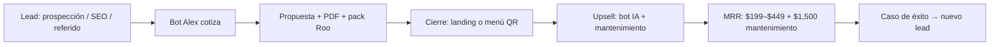
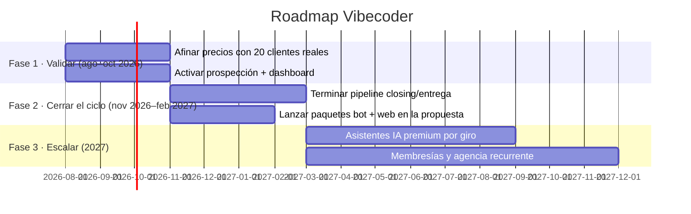

# 📊 Evaluación de Mercado y Estrategia · Agencia Vibecoder

> **Documento estratégico v2.0** — revisado y ampliado como CEO / AI Strategist.
> Fecha: agosto 2026 · Mercado: **México** (negocios pequeños y medianos / SMB).
> Fuente de verdad de precios: `lib/quote-engine.ts` · `lib/pricing-catalog.ts` ·
> `lib/agency-catalog.ts` · `lib/bots-catalog.ts` · `lib/industry-pricing.ts`.

---

## 1. Resumen ejecutivo

**Tesis:** "Entrar barato, cobrar recurrente", apalancada en **DeepSeek como ventaja
estructural de costo** — el único modelo de este mercado que puede sostener
suscripciones de $199–$449 MXN/mes con margen >90%.

**Posicionamiento:** calidad de agencia premium (mobile-first, Lighthouse ≥ 90, SEO
local, IA integrada) a **precio de freelancer** (cuartil bajo-medio del mercado). El
cliente no compra "una web": compra una máquina de captación que trabaja 24/7.

**Tres líneas de ingreso:**

1. **Setup de proyectos web** (one-time) — de $3,500 (menú QR) a $40,000+ (marketplace).
2. **Setup de bots IA** (one-time, add-on) — $3,500 / $5,900 / $8,500.
3. **Ingreso recurrente** (bots + mantenimiento) — $199–$449/mes por bot y
   $1,500/mes de mantenimiento web: el motor del margen y del valor de la agencia.

**Meta a 12 meses (escenario base):** ~8 proyectos web/mes, attach de bots ≥35% y
**MRR > $30,000 MXN/mes** al cierre del año (bots + mantenimiento). Ver §7.

---

## 2. Tesis de negocio y posicionamiento

### 2.1 La apuesta en una línea

> "Vendemos presencia digital + asistentes IA a negocios que hoy solo tienen Facebook,
> a un precio que se siente barato para lo que ven, y con un margen que la competencia
> no puede replicar porque depende de LLMs caros o SaaS extranjeros."

### 2.2 El moat (por qué ganamos sin competir en precio)

1. **DeepSeek = costo de servir casi nulo.** ~$0.065 MXN por conversación de bot
   (ver §7.1). Un bot de $299/mes necesitaría >3,000 conversaciones/mes para volverse
   caro; un SMB real genera 100–1,500. **Margen de suscripción >90%**, y aun así
   cobramos la mensualidad más baja del mercado con IA real.
2. **Bot integrado, no pegado.** No es ManyChat sobre la web: es una cadena LangChain
   entrenada con la info del negocio, parte de la misma propuesta → más valor
   percibido, más retención, menos competencia directa.
3. **Motor de cotización conversacional propio.** El bot "Alex" cotiza en minutos y en
   español, en el lenguaje del dueño del negocio — la competencia SMB no lo tiene, y
   convierte a quien cotiza en un cliente que ya entendió el valor.
4. **Margen de mejora en 2 dimensiones:** el costo por mensaje cae con la escala
   (DeepSeek es más barato que GPT-4o) y el valor percibido sube con cada giro que
   dominamos (copy, bots, casos de éxito).

### 2.3 Posicionamiento deseado (mapa 2×2)

| Eje                           | Nosotros                        | Agencia boutique | Freelancer | SaaS (ManyChat/Landbot)   |
| ----------------------------- | ------------------------------- | ---------------- | ---------- | ------------------------- |
| **Precio**                    | Medio-bajo (cuartil bajo-medio) | Alto             | Bajo       | Bajo (pero SaaS, sin web) |
| **Valor percibido / acabado** | Alto (premium)                  | Alto             | Medio      | Medio                     |
| **Recurrencia / retención**   | Alta (bot + mantenimiento)      | Baja (proyecto)  | Nula       | Media (SaaS)              |
| **IA integrada**              | Sí (DeepSeek + LangChain)       | Parcial          | No         | Limitada (plantillas)     |

**Cuña de entrada:** los vacíos del mapa son "barato + premium" (nosotros) y
"recurrente + IA" (nosotros). Nadie más ocupa esa esquina en el SMB mexicano.

---

## 3. Mercado de los bots (asistentes IA)

### Lo que cobra la competencia en México

| Jugador                                      | Modelo                   | Precio típico                                    |
| -------------------------------------------- | ------------------------ | ------------------------------------------------ |
| Agencias de chatbots (ManyChat / Chatfuel)   | Suscripción SaaS + setup | $2,000–$15,000 MXN setup + $1,000–$4,000 MXN/mes |
| Bots "a la medida" con IA (agencia boutique) | Proyecto                 | $15,000–$80,000 MXN el proyecto                  |
| ManyChat / Chatfuel / Landbot                | SaaS (sin desarrollo)    | $30–$200 USD/mes (~$540–$3,600 MXN)              |
| Voiceflow / Botpress (con DeepSeek/OpenAI)   | SaaS + tokens            | $20–$100 USD/mes + consumo                       |
| Desarrollo manual con OpenAI (freelancer)    | Proyecto                 | $8,000–$40,000 MXN                               |

**Lectura de mercado:** todos cobran caro el setup o caro la mensualidad (SaaS).
Nuestro rango **$3,500 setup + $199/mes** está **por debajo de todo el mercado** con
margen mayor (DeepSeek). El bot FAQ ($3,500 + $199) cuesta menos que una landing de la
competencia → es el "producto de entrada" perfecto.

### Precios de los bots (accesibles, IVA incluido)

| Complejidad  | Ejemplos de bot                                              | Setup          | Mensualidad      |
| ------------ | ------------------------------------------------------------ | -------------- | ---------------- |
| **Básica**   | FAQ, promociones, captura de leads, encuestas                | **$3,500 MXN** | **$199 MXN/mes** |
| **Media**    | Atención al cliente, citas, dudas, recomendador, multilingüe | **$5,900 MXN** | **$299 MXN/mes** |
| **Avanzada** | Ventas/cierre, cotización rápida, membresías                 | **$8,500 MXN** | **$449 MXN/mes** |

**Estrategia de gancho:** el bot más barato (FAQ) se ofrece casi "regalado" como
upsell ("te incluyo el bot de preguntas frecuentes para que no pierdas clientes que
preguntan de noche"). El setup cubre el costo; el margen real viene de la mensualidad.

### Catálogo completo (12 bots) — `lib/bots-catalog.ts`

| #   | Bot                             | Caso de uso                          | Setup  | Mensualidad |
| --- | ------------------------------- | ------------------------------------ | ------ | ----------- |
| 1   | Bot de preguntas frecuentes     | Dudas (horarios, precios, ubicación) | $3,500 | $199        |
| 2   | Bot de atención al cliente      | Soporte + escalamiento a humano      | $5,900 | $299        |
| 3   | Bot de citas y agenda           | Agendar, confirmar, recordar         | $5,900 | $299        |
| 4   | Bot de ventas y cierre          | Cualificar, cotizar, cerrar          | $8,500 | $449        |
| 5   | Bot de promociones y ofertas    | Promos, cupones, descuentos          | $3,500 | $199        |
| 6   | Bot capturador de leads         | Nombre, contacto, interés            | $3,500 | $199        |
| 7   | Bot de dudas de productos       | Garantías, envíos, pagos             | $5,900 | $299        |
| 8   | Bot recomendador                | Recomendar producto/servicio ideal   | $5,900 | $299        |
| 9   | Bot de cotización rápida        | Cotizar en minutos                   | $8,500 | $449        |
| 10  | Bot de encuestas y feedback     | Opiniones, reseñas                   | $3,500 | $199        |
| 11  | Bot de membresías/suscripciones | Altas, renovación, pagos             | $8,500 | $449        |
| 12  | Bot multilingüe                 | Español/inglés/más                   | $5,900 | $299        |

**Regla de recomendación (implementada en código):** `detectarBotsRecomendados`
sugiere máximo 3 bots según el giro (p.ej. landing → `bot_leads` + `bot_faq`) para no
abrumar y vender el paquete correcto. Es la "escalera" operando sola.

---

## 4. Segmentos objetivo (ICP)

Cada segmento tiene un "producto de entrada" y un "upsell natural". Alineado con los
GIROS de `lib/industry-pricing.ts` (tier alto / medio / ajustado).

### 4.1 Tier ALTO — presupuesto $15k–$70k · vender valor, no precio

| Segmento              | Producto de entrada   | Upsell natural                   | Triggers de compra                         |
| --------------------- | --------------------- | -------------------------------- | ------------------------------------------ |
| Abogados / bufetes    | Corporativo $15k      | Bot ventas/cierre + SEO          | Casos perdidos por no encontrarlos         |
| Clínicas / médicos    | Citas $15k            | Bot citas + recordatorios        | Llamadas perdidas, inasistencias           |
| Inmobiliarias         | Portal $25k           | Bot ventas + leads por propiedad | Comisiones perdiéndose con la competencia  |
| Constructoras         | Corporativo + galería | Bot ventas + cotización          | Contratos perdidos por falta de portafolio |
| Consultores / coaches | Landing $8.5k         | Bot ventas + membresías          | Horas regaladas explicando su servicio     |

### 4.2 Tier MEDIO — presupuesto $10k–$32k · vender conveniencia

Dentistas, estéticas/barberías, restaurantes, gimnasios, contadores, fotógrafos.
Producto de entrada: **citas $15k** o **landing $8.5k**. Upsell: **bot de citas
($5,900 + $299/mes)** y menú QR ($3,500) en restaurantes. Trigger: "nadie agenda fuera
de horario / me pierdo llamadas".

### 4.3 Tier AJUSTADO — presupuesto $5k–$20k · vender urgencia local

Mecánicos, tiendas de barrio, servicios para el hogar. Producto de entrada: **landing
$8.5k** o **menú QR $3.5k**. Upsell: bot FAQ/leads ($3,500 + $199/mes). Trigger: "me
buscan en Google y no aparezco" / "pierdo clientes de noche".

### 4.4 Anti-segmento (a quién NO perseguir)

- Negocios sin teléfono/WhatsApp verificado (sin canal de cierre).
- Pedidos de "página en $500" (sin margen ni respeto al trabajo).
- Empresas con web interna/TI propio (compra racional, ciclo largo, poco fit con IA).

---

## 5. Análisis competitivo · páginas web

### Lo que cobra la competencia en México

| Tipo                             | Rango de mercado     | Nuestro precio "desde" |
| -------------------------------- | -------------------- | ---------------------- |
| Landing page básica              | $5,000–$12,000 MXN   | **$8,500 MXN**         |
| Sitio corporativo (multi-página) | $10,000–$25,000 MXN  | **$15,000 MXN**        |
| Tienda online (e-commerce)       | $18,000–$60,000 MXN  | **$20,000 MXN**        |
| Sistema de citas                 | $12,000–$35,000 MXN  | **$15,000 MXN**        |
| Plataforma / webapp a medida     | $25,000–$120,000 MXN | **$25,000 MXN**        |
| Blog / contenido                 | $6,000–$18,000 MXN   | **$9,000 MXN**         |
| Portafolio                       | $5,000–$15,000 MXN   | **$7,000 MXN**         |

**Lectura:** estamos en el cuartil bajo-medio con acabado premium. En landing el
mercado toca $5,000 (freelancers); a $8,500 ofrecemos lo que un freelancer no puede
(SEO, velocidad, IA, soporte). En ecommerce ($20k vs. $18k–$60k) somos de los más
baratos del rango con pasarela y panel incluidos.

### Tipos de web de la agencia — `lib/agency-catalog.ts`

**Ya los cotiza el motor:**

| #   | Tipo                          | Desde   | Entrega    | Complejidad |
| --- | ----------------------------- | ------- | ---------- | ----------- |
| 1   | Landing page                  | $8,500  | 3-8 días   | Básica      |
| 2   | Sitio corporativo             | $15,000 | 7-15 días  | Media       |
| 3   | Tienda online                 | $20,000 | 10-25 días | Avanzada    |
| 4   | Sistema de citas              | $15,000 | 7-18 días  | Media       |
| 5   | Plataforma / sistema a medida | $25,000 | 10-30 días | Avanzada    |
| 6   | Blog                          | $9,000  | 5-12 días  | Media       |
| 7   | Portafolio                    | $7,000  | 4-10 días  | Media       |

**Productos de expansión (amplían la cartera para captar más clientes):**

| Tipo                            | Desde      | Entrega    | Para quién                                  |
| ------------------------------- | ---------- | ---------- | ------------------------------------------- |
| Menú digital con QR             | **$3,500** | 2-4 días   | Restaurantes, cafeterías (venta de entrada) |
| Reservas para restaurante       | $12,000    | 7-12 días  | Restaurantes con mesas                      |
| Portal inmobiliario             | $25,000    | 15-30 días | Agencias y desarrolladores                  |
| Directorio / listado            | $22,000    | 15-25 días | Cámaras, asociaciones                       |
| Marketplace multi-vendedor      | $40,000    | 30-60 días | Emprendedores                               |
| Portal de membresías            | $28,000    | 15-30 días | Gimnasios, academias                        |
| Plataforma de cursos online     | $30,000    | 20-35 días | Instructores, coaches                       |
| Portal de citas para salud      | $26,000    | 15-30 días | Consultorios, clínicas                      |
| Landing de evento               | $6,500     | 3-7 días   | Lanzamientos, registro                      |
| PWA instalable (app sin tienda) | $12,000    | 7-15 días  | Cualquier negocio                           |
| Sitio multilingüe               | $11,000    | 6-12 días  | Zonas turísticas/frontera                   |

---

## 6. Estrategia de precios (psicología + tácticas)

### Principios no negociables

1. **Precio coherente en todo** (UI, PDF, copy, prompt, WhatsApp): regla #7 de
   `AGENTS.md`. Un mismo número, citado por `calcularTotalDeterminista()`.
2. **Siempre un número exacto, nunca un rango** en lo que ve el cliente final.
3. **La mensualidad se muestra como "desde $X/mes"** (reencuadre a 24 meses, §6.4).

### 6.1 Anclaje (precios "desde")

Cada tipo muestra un **"desde"** (base) que ancla barato; las features suben el total
de forma transparente. El cliente siente control y nosotros margen.

### 6.2 Señuelo (niveles básico / profesional / avanzado)

En el catálogo de la IA (`pricing-catalog.ts`) cada categoría tiene 3 niveles. El
**profesional funciona como señuelo**: hace que el básico se vea "razonable" y el
avanzado "premium". La mayoría debe cerrar en profesional.

### 6.3 Bundling de bots (el corazón del margen)

Reglas implementadas (ver §13):

- El **setup del bot se suma a la cotización** (precio exacto).
- La **mensualidad se muestra aparte** ("desde $199/mes").
- El bot entra en la **propuesta comercial** y en el **prompt técnico** (el pack de Roo
  Code incluye su implementación LangChain).
- `detectarBotsRecomendados` sugiere ≤3 bots por giro (no abruma, vende paquete).

**Oferta gancho (venta directa):** "FAQ incluido en el primer mes" o "menú QR de
prueba" para quitar la fricción; el LTV del bot paga con creces el descuento (ver §7.2).

### 6.4 Reencuadre a cuota mensual

`cuota_mensual = totalExacto / 24` (p.ej. landing $12,760 → **$532/mes**). Reduce el
precio percibido de un proyecto de $25k a ~$1,000/mes y es el argumento de venta en el
copy (`generarValorNegocio`).

### 6.5 La escalera de venta formalizada

1. **Entrada barata**: menú QR $3,500 · landing $8,500 · FAQ $3,500 → "sí" fácil.
2. **Upsell natural**: + bot FAQ/leads (+$3,500 + $199/mes) · + bot citas si agenda.
3. **Escalada**: + e-commerce · + portal a medida · + membresías (recurrente).
4. **Recurrente**: mensualidad del bot (DeepSeek) + mantenimiento web $1,500/mes.

---

## 7. Modelo financiero y economía unitaria

### 7.1 Costo real de DeepSeek (el habilitador)

Motor: **DeepSeek `deepseek-chat`** (V3) vía `https://api.deepseek.com` con LangChain.
Precios por 1M tokens (aprox.):

| Concepto             | DeepSeek-chat |
| -------------------- | ------------- |
| Entrada (1M tokens)  | ~$0.27 USD    |
| Salida (1M tokens)   | ~$1.10 USD    |
| Tipo de cambio usado | ~$18 MXN/USD  |

**Costo por conversación típica** (~1,000 tokens entrada + ~800 salida):

- Entrada: 0.001M × $0.27 × 18 ≈ **$0.049 MXN**
- Salida: 0.0008M × $1.10 × 18 ≈ **$0.016 MXN**
- **Total ≈ $0.065 MXN por conversación.**

Con $199–$449/mes, el cliente tendría que generar **>3,000–7,000 conversaciones/mes**
para que DeepSeek nos cueste más de lo que cobramos. Un SMB real genera **100–1,500
conversaciones/mes** → hosting real **$6–$100 MXN/mes**. **Margen de suscripción >90%.**

### 7.2 Economía unitaria del bot (setup + recurrente)

| Complejidad  | Setup venta | Costo interno\* | Margen setup | MRR  | Costo hosting/mes | Margen MRR |
| ------------ | ----------- | --------------- | ------------ | ---- | ----------------- | ---------- |
| **Básica**   | $3,500      | ~$1,800         | ~49%         | $199 | $6–$100           | >90%       |
| **Media**    | $5,900      | ~$3,500         | ~41%         | $299 | $6–$100           | >90%       |
| **Avanzada** | $8,500      | ~$6,000         | ~29%         | $449 | $6–$100           | >90%       |

\* hora-hombre dev en México (~$150–$250/h).

**LTV de un bot media:** vida útil ~24 meses, churn 3%/mes → `$299 × 24 × ~0.8 ≈
$5,700` de MRR por cliente. **CAC ≈ $0–$500** (es upsell a un cliente que ya compró la
web) → **LTV/CAC > 10**. Ese ratio no existe en casi ningún negocio.

### 7.3 Economía unitaria de la web (one-time)

| Tipo        | Venta   | Costo aprox.\* | Margen bruto |
| ----------- | ------- | -------------- | ------------ |
| Landing     | $8,500  | ~$4,500        | ~47%         |
| Corporativo | $15,000 | ~$8,000        | ~47%         |
| Ecommerce   | $20,000 | ~$12,000       | ~40%         |
| Citas       | $15,000 | ~$8,500        | ~43%         |
| Webapp      | $25,000 | ~$15,000       | ~40%         |
| Blog        | $9,000  | ~$5,000        | ~44%         |
| Portafolio  | $7,000  | ~$3,800        | ~46%         |

\* estimado: horas reales + plataformas. Validar con datos del dashboard.

### 7.4 Escenarios (proyección mensual)

Supuestos base: ticket web promedio ~$14,000 · setup de bot promedio ~$5,000 · MRR por
bot ~$300 · churn de bots 3%/mes · 30% de las webs toman mantenimiento de $1,500/mes.

| Escenario       | Webs/mes | Attach bots | Ingreso one-time/mes | MRR al mes 12\* | Margen bruto aprox. |
| --------------- | -------- | ----------- | -------------------- | --------------- | ------------------- |
| **Conservador** | 4        | 25%         | ~$61,000             | ~$18,000        | ~42%                |
| **Base**        | 8        | 35%         | ~$126,000            | ~$35,000        | ~46%                |
| **Crecimiento** | 15       | 45%         | ~$243,000            | ~$75,000        | ~48%                |

\* MRR acumulado (bots + mantenimiento), neto de churn. El one-time paga la operación;
el MRR construye el valor de la agencia y el colchón ante meses flojos.

### 7.5 Break-even

Con costos fijos estimados de **$40k–$60k/mes** (desarrollo + herramientas), se cubren
con **4–6 webs/mes**. El escenario base (8 webs) opera con margen desde el mes 1 y
acumula MRR. Regla de decisión: **no contratar gasto fijo nuevo sin +2 webs/mes de
cobertura.**

---

## 8. Go-to-market

### 8.1 Canales (México SMB)

1. **Prospección propia (el proyecto mismo)** — el módulo `prospecting/` busca leads
   (SerpAPI + agente LangChain), les escribe por WhatsApp (Baileys) con mensajes
   personalizados por giro y los lleva al bot "Alex" a cotizar. Canal #1: **bajo
   costo, personalizado, escalable**.
2. **SEO local / Google Maps** — cada web entregada posiciona al cliente y nos da
   caso de éxito + backlink.
3. **Redes + WhatsApp** — contenido de valor (antes/después, casos, precios
   transparentes) y cierre por WhatsApp.
4. **Alianzas locales** — contadores, despachos, imprentas que refieren negocios que
   "no tienen página".
5. **El bot Alex como embudo** — la landing/chat público (app/demo) cotiza 24/7 y
   captura el lead con intención comprada.

### 8.2 Funnel de venta

### 8.3 Métricas de pipeline (objetivo)

Leads calificados/mes ≥ 40 · tasa de respuesta WhatsApp ≥ 25% · close rate ≥ 25% ·
attach de bots ≥ 35% · churn de bots ≤ 3%/mes.

---

## 9. KPIs y tablero de control

| Área        | KPI                                  | Objetivo    |
| ----------- | ------------------------------------ | ----------- |
| Prospección | Leads calificados / mes              | ≥ 40        |
| Prospección | Tasa de respuesta (WhatsApp)         | ≥ 25%       |
| Venta       | Close rate (propuesta → cliente)     | ≥ 25%       |
| Venta       | Ticket promedio                      | ≥ $14,000   |
| Venta       | Attach de bots por proyecto          | ≥ 35%       |
| Entrega     | Días de entrega vs. prometido        | ≤ prometido |
| Recurrente  | MRR (bots + mantenimiento)           | Creciente   |
| Recurrente  | Churn de bots / mes                  | ≤ 3%        |
| Margen      | Costo real por conversación DeepSeek | < $0.10 MXN |
| Margen      | Horas reales vs. estimadas           | ≤ +20%      |

> El dashboard (`app/(prospecting)/dashboard`) ya cubre leads, campañas y mensajes;
> falta agregar **MRR, churn y attach** para cerrar el tablero estratégico.

---

## 10. FODA (SWOT)

**Fortalezas**

- Moat de costo con DeepSeek (margen >90% en recurrente).
- Motor de cotización conversacional propio (Alex) que educa y cierra.
- Precios bajos con acabado premium (difícil de copiar sin IA propia).
- Prospección automatizada por WhatsApp (el propio proyecto se vende).

**Oportunidades**

- Mercado SMB mexicano aún sin presencia digital madura (millones de negocios).
- Crecimiento de la demanda de "agentes IA" en 2026–2027.
- Ingreso recurrente (bots/mantenimiento) que valoriza la agencia.
- Catálogo ampliable (membresías, cursos, telemedicina) con demanda creciente.

**Debilidades**

- Dependencia de un solo LLM (DeepSeek) y de su disponibilidad de API.
- El pipeline de cierre/entrega (PDF/mockup/negociación) está incompleto o roto
  (`prospecting-wip` §0 del AGENTS.md) → fuga de cierre.
- Capacidad de entrega limitada a la mano de obra (cuello de botella en dev).
- Marca joven: sin casos de éxito ni reseñas aún.

**Amenazas**

- Competencia SaaS baja precios y usa IA generativa barata.
- DeepSeek cambia precios/condiciones (riesgo de proveedor único).
- Plataformas "página gratis" (Carrd, Wix, Canva) para clientes más básicos.
- Depreciación del MXN / inflación en costos de herramientas.

---

## 11. Riesgos y mitigaciones

| Riesgo                                 | Prob. | Impacto | Mitigación                                                                                 |
| -------------------------------------- | ----- | ------- | ------------------------------------------------------------------------------------------ |
| DeepSeek sube precios / cae API        | Media | Alto    | Cliente multi-LLM (`lib/llm-client.ts` ya soporta OpenRouter); subir mensualidad con aviso |
| Cuello de botella en entrega           | Alta  | Alto    | Plantillas, packs Roo Code (`prompt-builder`), limitar proyectos simultáneos               |
| Churn de bots mayor al 3%              | Media | Medio   | Onboarding de valor (bot integrado a WhatsApp), reporte mensual de ahorro                  |
| Pipeline de cierre roto (fuga)         | Alta  | Media   | Priorizar cerrar `prospecting/closing/` (roadmap Fase 2)                                   |
| Venta muy barata (margen < 30%)        | Media | Medio   | Nunca bajar del "desde"; vender alcance, no descuento                                      |
| Dependencia del fundador (todo-en-uno) | Alta  | Alto    | Documentar (AGENTS.md), automatizar con IA, delegar dev con packs                          |

---

## 12. Roadmap estratégico

**Prioridades inmediatas (Q3 2026):**

1. Validar demanda y precios con los primeros 20 clientes (registrar el "por qué
   compran / por qué no").
2. Completar el ciclo de cierre (PDF, mockup, negociación) — es la fuga actual.
3. Medir MRR, attach y churn desde el dashboard.
4. Construir 3 casos de éxito (restaurante con menú QR + FAQ, clínica con citas + bot
   de citas, inmobiliaria con portal + bot de ventas).

---

## 13. Anexo · Fuente de verdad de precios (mapeo al código)

| Concepto                            | Dónde vive en el código                                                                   |
| ----------------------------------- | ----------------------------------------------------------------------------------------- |
| Precios base del motor determinista | `lib/quote-engine.ts` → `PRECIOS` (landing $8,500 · corporativo $15,000 · agenda +$5,600) |
| Catálogo por niveles (IA/fallback)  | `lib/pricing-catalog.ts` → `PRICING_CATALOG` (base por nivel + features)                  |
| Precios "desde" de la agencia       | `lib/agency-catalog.ts` → `AGENCY_WEB_TYPES` (precioDesde + tiempoEntrega)                |
| Catálogo de bots + costos DeepSeek  | `lib/bots-catalog.ts` → `BOTS_CATALOG` + `DEEPSEEK_COSTOS`                                |
| Presupuesto/copy por giro           | `lib/industry-pricing.ts` → `GIROS` (tier, presupuesto, pitch)                            |
| Total exacto compartido UI/PDF      | `calcularTotalDeterminista()` (quote-engine) — regla #7 de AGENTS.md                      |

> **Regla de oro para editar precios:** cambiar SOLO las fuentes de arriba; nunca
> hardcodear montos en componentes o copys. Si editas un precio, corre
> `npm run test:regression` y `npm run prompt:preview` / `quote:preview` para confirmar
> coherencia en UI, PDF y pack de prompts.
